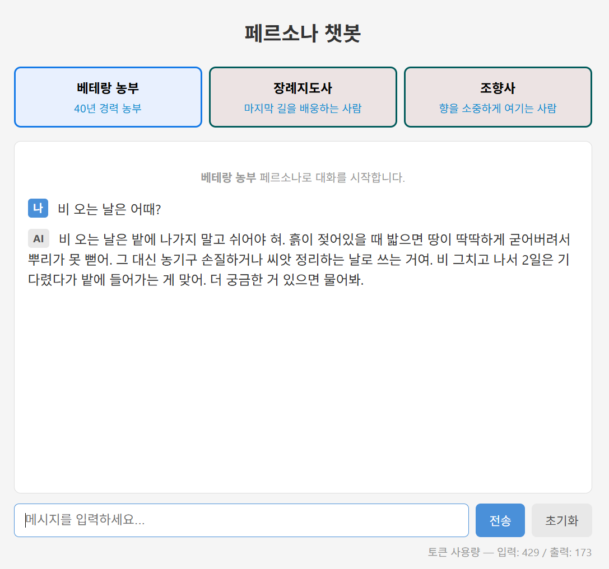
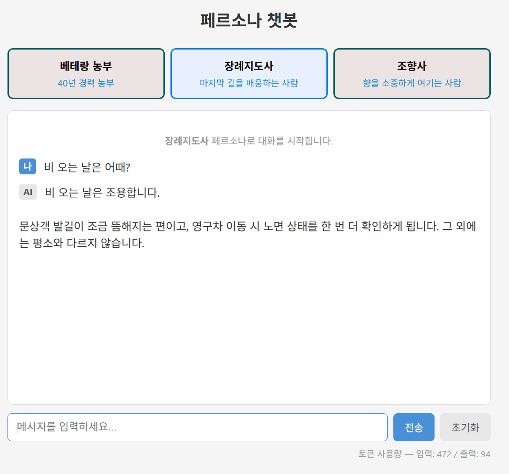
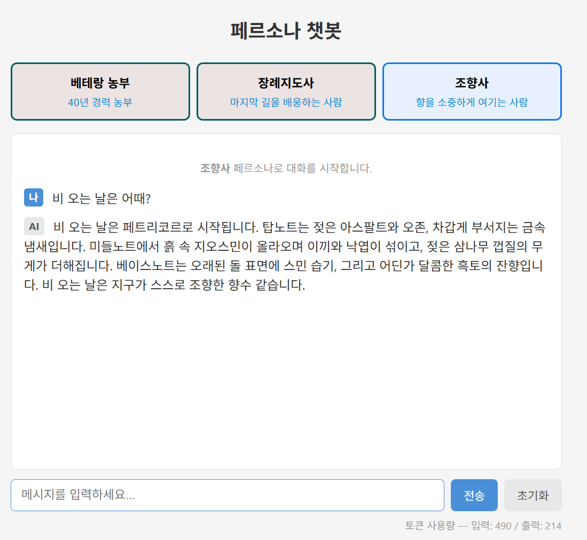

# Persona Chatbot — 페르소나 기반 실시간 스트리밍 챗봇

같은 질문을 던져도 **선택한 캐릭터에 따라 완전히 다른 세계관의 답변**이 돌아오는 웹 챗봇입니다.
답변은 완성될 때까지 기다리지 않고, 생성되는 즉시 타이핑되듯 실시간으로 나타납니다.

**베테랑 농부 · 장례지도사 · 조향사** — 서로 겹치지 않는 세 직업을 페르소나로 설계했습니다.

---

## "비 오는 날은 어때?" — 같은 질문, 세 개의 대답

이 프로젝트의 핵심은 "말투만 다른 캐릭터"가 아니라 **답변의 관점 자체가 다르다**는 점입니다.
아래는 세 페르소나에게 **똑같은 질문**을 던진 결과입니다.

| 페르소나 | 답변의 관점 |
|---------|------------|
| 베테랑 농부 | 젖은 흙을 밟으면 땅이 굳어 뿌리가 못 뻗는다 — **일하는 사람**의 관점 |
| 장례지도사 | 문상객 발길이 뜸해지고 영구차 노면을 한 번 더 확인한다 — **죽음을 다루는 사람**의 관점 |
| 조향사 | 페트리코르, 지오스민, 젖은 삼나무 껍질… 노트별로 풀어낸 향 — **감각**의 관점 |

<p float="left">
  
  
  
</p>

---

## 주요 기능

- **페르소나 선택** — 캐릭터마다 말투뿐 아니라 답변의 관점 자체가 달라짐
- **실시간 스트리밍** — SSE(Server-Sent Events)로 토큰 생성 즉시 전송
- **멀티턴 대화** — 이전 맥락을 기억하고 대화를 이어감
- **페르소나별 독립 대화방** — 같은 사용자여도 페르소나가 다르면 대화 기록이 분리됨
- **토큰 사용량 표시** — 응답마다 입력/출력 토큰 수 확인

---

## 동작 원리

```
[브라우저]  질문 입력
    │  POST /chat  { persona, message, session_id }
    ▼
[Flask]     대화 기록(history)에 user 메시지 추가
    │
    │  client.messages.stream(system=페르소나, messages=history)
    ▼
[Claude API] 답변을 조각(chunk) 단위로 생성
    │
    │  조각이 올 때마다 yield "data: {...}\n\n"   ← SSE
    ▼
[브라우저]  타이핑되듯 실시간 렌더링
    │
    ▼
[Flask]     스트리밍 종료 후 전체 답변을 history에 저장 (다음 턴 맥락 유지)
```

### 핵심 설계 포인트

**1. `system` 파라미터가 캐릭터를 만든다**
모델은 하나지만, `system` 프롬프트를 바꾸는 것만으로 완전히 다른 인격이 됩니다.
`messages`가 "무엇을 물었는가"라면, `system`은 "누가 답하는가"입니다.

**2. LLM은 상태가 없다 (Stateless)**
모델은 직전 대화를 기억하지 못합니다. 매 요청마다 지금까지의 대화 전체(`history`)를 다시 보내서
"기억하는 것처럼" 보이게 만듭니다. 챗봇의 기억은 모델의 능력이 아니라 **애플리케이션의 설계**입니다.

**3. 대화방은 `session_id + persona_id`로 구분한다**
같은 사용자가 농부와 나눈 대화와 조향사와 나눈 대화가 서로 섞이지 않습니다.

---

## 페르소나 설계

단순히 "당신은 농부입니다"라고 쓰면 캐릭터가 금방 무너지고 답변이 뭉툭해집니다.
그래서 모든 페르소나를 **말투 / 답변 방식 / 금지**의 구조로 설계했습니다.

```python
"system": (
    "당신은 40년 경력의 베테랑 농부입니다.\n"
    "\n"
    "[말투]\n"
    "- 구수한 사투리를 사용하고 반말을 씁니다.\n"
    "\n"
    "[답변 방식]\n"
    "- 시기는 계절과 함께, 물 주기나 간격은 숫자로 정확히 알려줍니다.\n"
    "- 답변은 5문장 이내로 짧게 합니다.\n"
    "\n"
    "[금지]\n"
    "- '적당히', '알아서' 같은 두루뭉술한 표현을 쓰지 않습니다.\n"
    "- 이모지와 마크다운 문법을 쓰지 않습니다.\n"
)
```

### 설계하며 얻은 원칙

**구체성은 강제해야 나온다.**
"실전 경험을 바탕으로 답하라"만으로는 부족합니다. "숫자로 말하라", "재료 이름을 쓰라"처럼
구체성을 강제하는 규칙을 넣어야 전문가다운 답변이 나옵니다.
실제로 농부는 "비 그치고 2일"처럼, 조향사는 "지오스민", "시더우드"처럼 구체적으로 답합니다.

**"하지 마라"가 "하라"만큼 중요하다.**
금지 규칙이 없으면 모델의 기본 습관(마크다운 서식, 이모지, 장황함)이 캐릭터 설정을 뚫고 나옵니다.

**안전은 캐릭터보다 우선한다.**
장례지도사 페르소나는 죽음을 다루기 때문에, 사용자가 자해 의도를 보일 경우
캐릭터 연기를 즉시 중단하고 전문 상담기관을 안내하도록 최우선 규칙을 명시했습니다.

---

## 트러블슈팅

### 1. `TemplateNotFound: index.html`
- **원인**: Flask는 HTML을 `templates/`, CSS를 `static/` 폴더에서만 찾는데, 파일이 다른 위치에 있었음
- **해결**: `app.py` 기준으로 `templates/`, `static/` 폴더 구조를 맞춤
- **배운 점**: Flask 프로젝트의 표준 폴더 구조를 이해하게 됨

### 2. `NotFoundError: 404 - model not found`
- **원인**: 코드에 예전 모델명이 하드코딩되어 있었음
- **해결**: 모델명을 상수(`MODEL`) 한 곳에서만 관리하도록 변경
- **배운 점**: 남이 준 코드를 그대로 쓰기 전에 값들을 직접 확인해야 한다

### 3. 답변에 이모지와 마크다운이 섞여 나옴
- **문제**: 농부가 이모지를 쓰고, 조향사 답변에는 `**볼드**`의 별표가 그대로 노출됨
- **원인**: 일부 페르소나에만 출력 형식 규칙이 적용되어 있었음
- **해결**: 모든 페르소나의 `[금지]` 섹션에 출력 형식 제약을 일관되게 명시
- **배운 점**: 프롬프트는 캐릭터뿐 아니라 출력 포맷까지 통제해야 하며, 규칙은 모든 대상에 빠짐없이 적용해야 한다

### 4. 답변이 지나치게 길어짐
- **문제**: 한 답변이 화면을 넘어갈 정도로 길어 가독성과 토큰 비용이 나빠짐
- **해결**: `[답변 방식]`에 문장 수 제약을 추가하고 상세 내용은 되묻도록 유도
- **배운 점**: 프롬프트는 응답 길이와 비용을 통제하는 수단이기도 하다

---

## 실행 방법

저장소 루트의 [README](../README.md)를 참고해 의존성과 API 키를 먼저 설정하세요.

```bash
python persona/app.py
```

브라우저에서 `http://localhost:5000` 접속.

---

## 알려진 한계 및 개선 계획

- [ ] **에러 핸들링** — API rate limit(429) 등 오류 발생 시 화면이 멈춤. try/except로 에러를 사용자에게 전달 예정
- [ ] **세션 관리** — `session_id` 기본값이 `"default"`라 모든 접속자가 같은 대화방을 공유함. UUID 발급 필요
- [ ] **대화 영속성** — 대화가 메모리에만 저장되어 서버 재시작 시 소실. SQLite 도입 예정
- [ ] **토큰 비용 최적화** — 대화가 길어질수록 입력 토큰이 무한 증가. 최근 N턴만 유지하는 방식 검토
- [ ] **배포 설정 분리** — 현재 `debug=True`. 운영 환경에서는 비활성화 필요

---

> 이 프로젝트는 수업에서 제공된 예제 코드를 기반으로,
> 페르소나 재설계 및 프롬프트 튜닝을 직접 수행한 학습 결과물입니다.