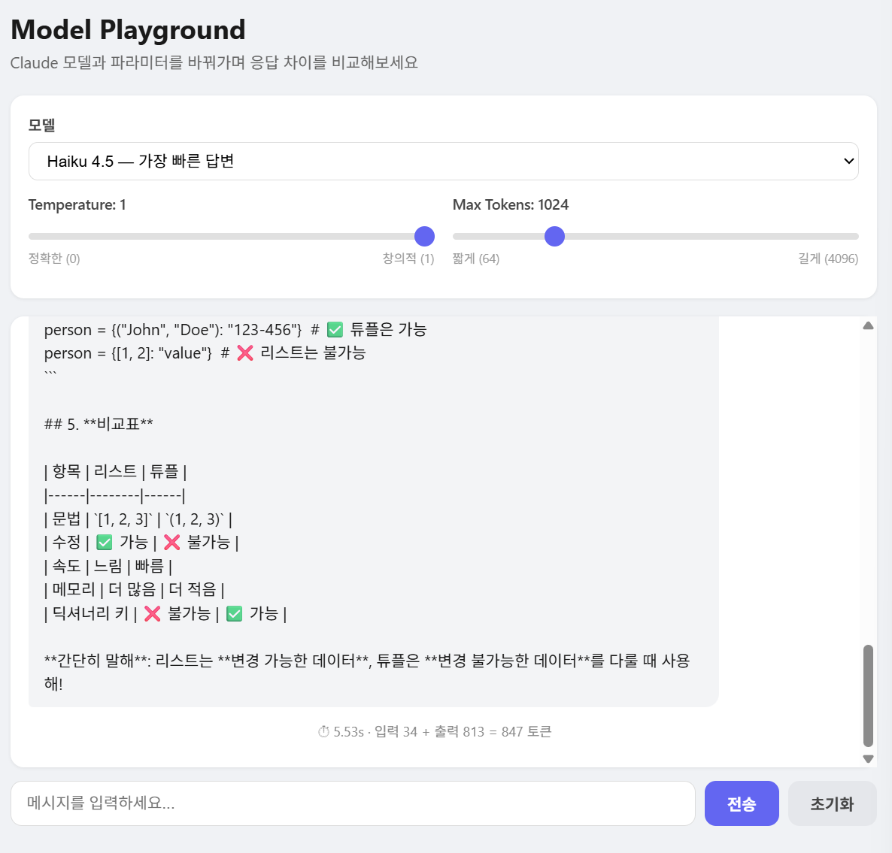

# Model Playground — 모델·파라미터 비교 플레이그라운드

같은 질문을 **여러 Claude 모델과 파라미터 조합**에 던져, 응답 품질·속도·토큰 사용량을 직접 비교해보는 실험 도구입니다.

"어떤 작업에 어떤 모델을 써야 하는가"를 감이 아니라 **직접 측정한 데이터**로 판단하는 것을 목표로 만들었습니다.

<p float="left">
  
<p>

---

## 주요 기능

- **모델 선택** — Haiku / Sonnet 중 선택해 호출 (Opus는 워크스페이스 권한상 접근 불가)
- **파라미터 조절** — `temperature`(무작위성)와 `max_tokens`(최대 길이)를 화면에서 직접 조절
- **실시간 스트리밍** — SSE로 토큰 생성 즉시 전송
- **응답 통계 표시** — 입력/출력 토큰 수와 **응답 소요 시간(초)**을 응답마다 표시
- **모델별 독립 대화방** — 모델별로 히스토리를 분리해 공정하게 비교

---

## 이 도구로 확인하려는 것

| 파라미터 | 무엇을 관찰하는가 |
|---------|------------------|
| 모델 (Haiku / Sonnet) | 같은 질문에 대한 품질 차이 vs 속도 차이 |
| `temperature` (0.0 ~ 1.0) | 0에 가까울수록 일관된 답, 높을수록 다양한 답 |
| `max_tokens` | 답변 최대 길이. 낮으면 문장 중간에 잘림 (요약이 아니라 '가위') |

---

## 실험 결과

> 모든 실험은 각 호출 전에 대화 기록을 **초기화**하여, 동일한 조건에서 비교했습니다.
> (초기화를 누락하면 이전 대화가 함께 전송되어 입력 토큰이 오염됩니다 — 아래 [트러블슈팅](#트러블슈팅) 참고)

### 실험 1 — 같은 질문, 모델별 속도 비교

질문: *"파이썬에서 리스트랑 튜플 차이가 뭐야?"*

| 모델 | 응답 시간 | 입력 토큰 | 출력 토큰 | 정답 |
|------|----------|----------|----------|------|
| Haiku 4.5 | 5.53초 | 34 | 813 | O |
| Sonnet | 10.76초 | 35 | 744 | O |

**관찰**
- 두 모델 모두 정확히 답했지만, **Haiku가 약 2배 빨랐다** (5.53초 vs 10.76초).
- 이 정도의 간단한 질문이라면 굳이 느린 모델을 쓸 이유가 없다 → **가벼운 작업엔 Haiku가 합리적**.
- 한편 두 모델 모두 출력이 700~800토큰으로 지나치게 길었다. 질문에 길이 제약을 주지 않으면
  모델은 기본적으로 장황하게 답하는 경향이 있음을 확인.

### 실험 2 — temperature에 따른 답변 다양성

질문: *"짧은 이야기의 첫 문장을 하나 써줘"* (각 설정마다 초기화 후 2번씩 실행)

| temperature | 1회차 | 2회차 |
|:-----------:|-------|-------|
| **0.0** | 그날 아침, 할머니는 평생 숨겨온 편지 한 장을 꺼냈다. | 그날 아침, 할머니는 평생 숨겨온 편지 한 장을 꺼냈다. |
| **1.0** | 그날 아침, 할머니는 평생 감춰온 편지를 꺼내 들었다. | 그날 아침, 할머니는 평생 숨겨온 낡은 상자를 꺼냈다. |

**관찰**
- **temperature 0.0** → 두 번 모두 **글자 하나까지 동일**. 가장 확률 높은 단어만 고르기 때문에 결과가 재현 가능(reproducible)하다.
- **temperature 1.0** → 두 번 모두 **다른 문장**. 확률 분포에 따라 단어를 다양하게 선택한다.
- 참고: "무작위로 색깔 하나"처럼 **답의 경우의 수가 적은 질문**에서는 temperature를 올려도 차이가 거의 없었다.
  temperature의 효과는 **답의 선택지가 넓은 질문(창작 등)**에서 뚜렷하게 드러난다.

### 실험 3 — max_tokens의 역할

설정: `max_tokens = 64`, 질문: *"파이썬의 역사를 자세히 설명해줘"*

**관찰**
- 답변이 완결되지 못하고 **문장 중간에서 잘렸다** (1.22초 만에 종료).
- `max_tokens`는 "짧게 요약해줘"라는 지시가 아니라, 정해진 길이에서 **강제로 자르는 '가위'**임을 확인.
  짧고 완결된 답을 원한다면 프롬프트로 지시해야 하며, `max_tokens`는 안전 상한으로만 써야 한다.

---

## 동작 원리

```
[브라우저]  모델 선택 + temperature/max_tokens 조절 + 질문
    │  POST /chat  { model, message, temperature, max_tokens, session_id }
    ▼
[Flask]     선택한 model_id와 파라미터로 API 호출
    │        (응답 시작 시각 기록)
    ▼
[Claude API] 답변을 조각 단위로 생성
    │  조각마다 yield send({"text": ...})   ← SSE
    ▼
[Flask]     스트리밍 종료 후 통계 전송
             yield send({"done": True, "input_tokens", "output_tokens", "elapsed"})
```

### 핵심 설계 포인트

**1. 브라우저 값은 문자열이므로 형변환이 필요하다**
`temperature`, `max_tokens`는 화면에서 문자열로 넘어오기 때문에 `float()`, `int()`로 변환합니다.

**2. 응답 시간을 직접 측정한다**
`time.time()`으로 요청 전후를 재서 모델별 속도 차이를 숫자로 확인합니다.

**3. 반복되는 SSE 포맷은 함수로 분리했다**
`data: {...}\n\n` 형식을 매번 쓰지 않도록 `send()` 함수로 묶어, 보낼 내용에만 집중할 수 있게 했습니다.

---

## 실행 방법

저장소 루트의 [README](../README.md)를 참고해 의존성과 API 키를 먼저 설정하세요.

```bash
python playground/app.py
```

브라우저에서 `http://localhost:5001` 접속.

---

## 트러블슈팅

### 모델 간 입력 토큰이 크게 차이나 비교가 공정하지 않았음
- **문제**: 같은 질문인데 Haiku는 입력 34토큰, Sonnet은 725토큰으로 측정됨
- **원인**: 실험 중간에 대화 기록을 초기화하지 않아, 이전 대화가 함께 전송되어 입력 토큰이 부풀려짐
- **해결**: 매 호출 전 초기화를 강제해 모든 모델이 동일한 입력으로 비교되도록 함 (재측정 결과 34 vs 35)
- **배운 점**: 측정 도구를 만들 때는 **비교 조건을 통제**하는 것이 도구 자체만큼 중요하다

---

## 알려진 한계 및 개선 계획

- [ ] **에러 핸들링** — rate limit(429)이나 접근 불가 모델(Opus) 호출 시 화면이 멈춤. try/except로 에러 종류별 메시지를 사용자에게 전달 예정
- [ ] **Opus 비교** — 현재 워크스페이스 권한상 Opus 접근 불가. 권한 확보 시 3개 모델 비교로 확장
- [ ] **비용 표시** — 토큰 수에 단가를 곱해 예상 비용까지 표시
- [ ] **나란히 비교 뷰** — 여러 모델의 답변을 한 화면에서 동시에 비교
- [ ] **배포 설정 분리** — 현재 `debug=True`. 운영 환경에서는 비활성화 필요

---

> 이 프로젝트는 수업에서 제공된 예제 코드를 기반으로,
> 모델·파라미터 비교 기능과 응답 통계 측정을 직접 구성한 학습 결과물입니다.